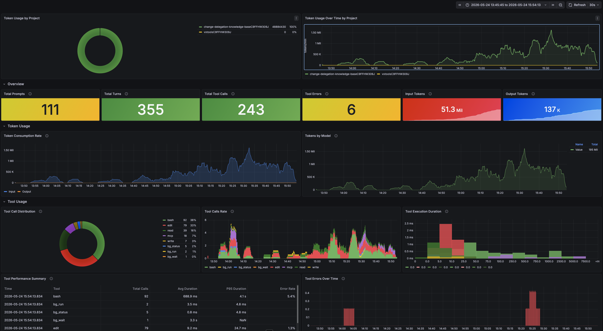
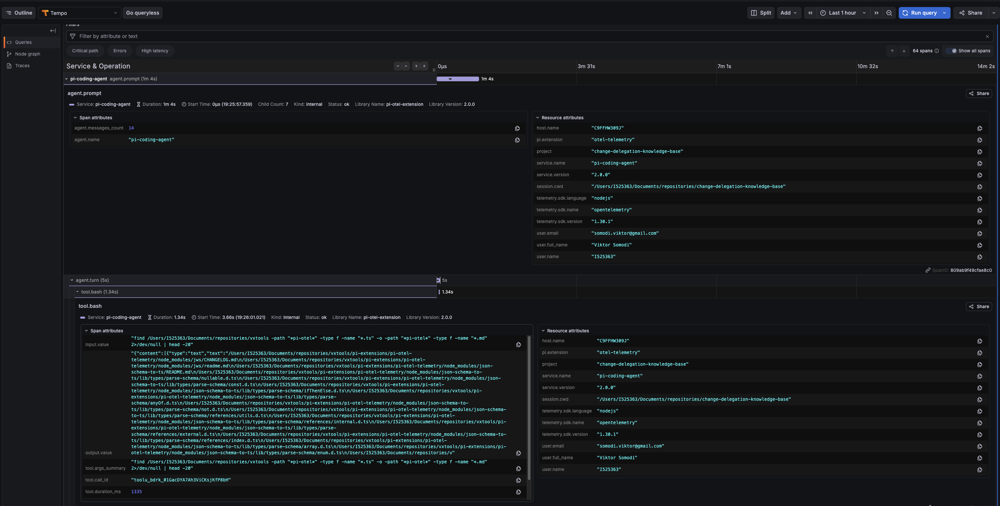

# LLM Usage Foundation

**Status:** finished
**Date:** May 6, 2025

## Problem

Using LLMs is expensive. Not "API call" expensive, but at the rates a serious agent burns through tokens, the bill matches a human worker on a lot of tasks. [METR's mid-2025 study](https://metr.org/blog/2025-07-10-early-2025-ai-experienced-os-dev-study/) actually measured experienced open-source developers and found they were *slower* with AI tools than without, even though they thought the opposite. Practitioner write-ups go further on the cost angle: [Cyfrin's breakdown](https://www.cyfrin.io/blog/expensive-and-slow-for-small-changes-why-ai-coding-agents-can-be-overkill) shows agents costing an order of magnitude more than a human edit for small changes.

That doesn't mean we stop using them. It means we have to be deliberate about it. Where is an LLM the right tool, where is it overkill, where does it spiral into burning 50× the tokens it actually needed. We can't answer those questions by feeling. We need data.

There's a second angle, more speculative. If we record what the LLM does, an LLM can read the recordings. And if an LLM can read the recordings, we can build something that watches its own usage and improves its own setup over time. Self-tuning agents.

## Assumptions

- We don't need a fancy analysis pipeline today. If we just store every interaction in a structured form, we can ask any question we want of it later, including questions we haven't thought of yet. Storage is the cheap part; re-creating the data after the fact is the impossible part.
- SAP-wide telemetry will eventually exist, but GDPR and personal-data rules will make any company-level pipeline coarse and slow. Every individual storing their own usage on their own machine sidesteps most of that. The data lives where it was generated, and the person who generated it owns it.

## Main learnings

- Storing per-person usage is cheap. Disk is free at the volumes we're talking about.
- For developers it's basically free of friction: they already have a terminal, they already run Docker, the telemetry just shows up.
- Non-devs (UX, PMs) are harder. The tooling works fine, but the mental model doesn't come for free. Spans, traces, token counts: all unfamiliar vocabulary, and most people don't want to learn it just to see how much their week cost.
- A small dev team can build a packaged, opt-in version of this for the whole company.
- Raw metrics (tokens, cost) are necessary but not sufficient. The real diagnostic value comes when the *content* of the interaction is stored alongside the metrics, in the same observability plane. When something costs too much, you need to read what was asked, not just how many tokens it consumed. The OTel GenAI semantic conventions provide the standard schema for this, and Tempo stores it.

## Organizational impact

See Secure Development. Same argument applies. AI usage is growing across the company, and the org needs a default-on way to see what's happening before it has to debug something blind.

## Approach

In normal software, observability is a solved problem. [OpenTelemetry](https://opentelemetry.io/) is the de-facto standard for traces, metrics, and logs.

In the last year, OpenTelemetry has been adding a vocabulary specifically for LLM and agent telemetry: the [GenAI semantic conventions](https://opentelemetry.io/docs/specs/semconv/gen-ai/). Standard attribute names like `gen_ai.system`, `gen_ai.request.model`, `gen_ai.usage.input_tokens` and `output_tokens`, plus events for capturing the full prompt and completion content. Following the spec means anything in the OTel ecosystem (Grafana, Tempo, Phoenix, Langfuse, Honeycomb) can read our data without translation.

The tracing layer is the single source of truth for both structure and content. A prompt, the tool calls it triggered, the child sessions it spawned, and the cost it generated all live in one trace. TraceQL covers both structured search (by attribute value) and time-ordered browsing (by span timestamp). One backend, one query language, one place to look.

## What we built

### The base: claude-code-monitoring-guide

We use Anthropic's [claude-code-monitoring-guide](https://github.com/anthropics/claude-code-monitoring-guide) as the receiving end. It's a Docker Compose stack: an OpenTelemetry Collector, Prometheus, and Grafana, pre-wired with dashboards for Claude Code's metrics.

```bash
git clone https://github.com/anthropics/claude-code-monitoring-guide.git
cd claude-code-monitoring-guide
docker compose up -d
```

Grafana on `http://localhost:3000` (admin/admin).

Then we tell Claude Code to send telemetry. On the host, in `~/.claude/settings.json`:

```json
{
  "env": {
    "CLAUDE_CODE_ENABLE_TELEMETRY": "1",
    "OTEL_METRICS_EXPORTER": "otlp",
    "OTEL_EXPORTER_OTLP_PROTOCOL": "grpc",
    "OTEL_EXPORTER_OTLP_ENDPOINT": "http://localhost:4317"
  }
}
```

For sandboxed runs, the same settings go into the sandbox kit, but with a small twist: the sandbox uses `http/protobuf` on port 4318, not gRPC on 4317. The agent process exits before a gRPC batch flushes and the traces get lost. Took us a while to figure that one out.

```yaml
environment:
  variables:
    CLAUDE_CODE_ENABLE_TELEMETRY: "1"
    OTEL_METRICS_EXPORTER: "otlp"
    OTEL_EXPORTER_OTLP_PROTOCOL: "http/protobuf"
    OTEL_EXPORTER_OTLP_ENDPOINT: "http://host.docker.internal:4318"
```

### Custom Grafana dashboards

The pre-wired dashboards cover the basics. They don't cover the questions we actually had: "how much did this week's deep-research sessions cost?", "what's my cost per project, broken down by model?". Those needed custom panels.

We can just ask Claude Code to build the dashboard. The monitoring stack auto-loads dashboard JSON from its provisioning folder, so the agent writes the file straight there. No copy-pasting JSON into the Grafana UI. Most of our dashboards started as a one-line prompt.



### Per-project metrics and tracing

Claude Code respects [`OTEL_RESOURCE_ATTRIBUTES`](https://code.claude.com/docs/en/monitoring-usage) and stamps every span and metric with whatever you put in there. Set it per project and you get a `project=<name>` label everywhere the data shows up.

The simplest setup: a per-project `.env` or shell hook that exports something like

```bash
export OTEL_RESOURCE_ATTRIBUTES="project=change-delegation,team=editor"
```

and suddenly Grafana can answer "how much did the change-delegation work cost this month" without a single SQL query.

pi has the same hook through the [pi-otel-telemetry extension](https://github.com/mprokopov/pi-otel-telemetry). It forwards the same OTEL env vars, so the same labels apply across both agents.

### Tracing prompts and responses

Claude Code's built-in telemetry is mostly metrics: tokens, cost, tool-call counts. The actual prompts and the actual responses don't get traced out of the box. If you want to see *what* the agent said, you can't, at least not without writing code.

pi is a different story. The [pi-otel-telemetry extension](https://github.com/mprokopov/pi-otel-telemetry) emits full OTel GenAI spans for every turn: prompt event, model attributes, token usage, completion event. Following the [GenAI semantic conventions](https://opentelemetry.io/docs/specs/semconv/gen-ai/) means the spans land in Grafana Tempo, Langfuse, or Phoenix without translation.



### Prompt content in trace data

The GenAI semantic conventions define where prompt and completion content belongs inside a trace. `gen_ai.input.messages` carries the full user prompt as a JSON-encoded span attribute. `gen_ai.content.prompt` and `gen_ai.content.completion` are Span Events attached to the inference span, holding the raw text alongside metadata like token count and finish reason.

Span Events are the correct vehicle for this. They live inside the trace, inherit its context (trace ID, parent span), and are stored together with the span in the tracing backend. "Find the prompt that caused this expensive tool chain" becomes a single TraceQL query, not a cross-system correlation exercise.

The spec marks content capture as opt-in, because prompts can be large and contain sensitive data. For personal or team usage on a local machine this is a non-issue. For company-wide rollout, the same mechanism supports external storage references instead of inline content, so you can still link to the content without storing it in the trace directly.

TraceQL makes prompt content searchable without separate infrastructure. A query like `{ span.gen_ai.input.messages =~ ".*keyword.*" }` finds every trace where the user asked about that keyword. Combined with the causal structure already in the trace (which tool spans are children of which prompt span), you get both "what was asked" and "what happened as a result" in one view.

### Persistent volumes and retention

The monitoring stack runs in Docker. Named volumes survive `docker compose down`, but not a `docker volume prune` or accidental removal. Without explicit attention to persistence, a 30-day retention policy means nothing if the underlying storage gets wiped on day 3.

All services should run with `restart: unless-stopped` so the stack comes back after a Docker or OS restart without manual intervention. This is the difference between telemetry that's always there and telemetry that requires someone to remember to start it.

Retention must be explicitly configured and matched to the expected analysis window. For cost analysis by week or month you need at minimum 30 days of data. Prometheus defaults to 15 days; Tempo defaults vary by version. Both need to be set consciously.

Agent sessions are bursty: metrics get emitted for 20 minutes while a session is active, then nothing for hours. Without staleness-safe recording rules (using `max_over_time` windows wider than the quiet gap), aggregated metrics like total cost or cache hit ratio disappear between sessions. The recording rules layer needs to be designed around this burst pattern, not the steady-stream pattern that Prometheus was built for.
